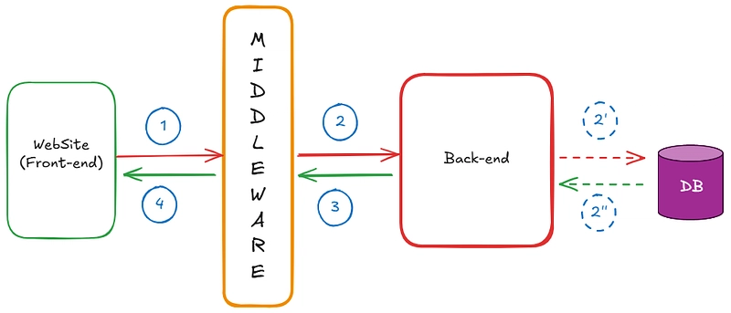

# Express.js

- [**Mongo DB](https://www.geeksforgeeks.org/mongodb/what-is-mongodb-working-and-features/) : Its a database which is using JSON format to store data.**
- [**Express JS](https://www.geeksforgeeks.org/node-js/express-js/) : Its a framework of JavaScript which enables developer to establish server.**
- [**React JS](https://www.geeksforgeeks.org/reactjs/react/) : React JS is client side library of JavaScript which is used to develop User Interface.**
- [**Node JS](https://www.geeksforgeeks.org/node-js/nodejs/): Node JS is a run time environment of JavaScript which allows developer to execute JS code directly in console**

**MERN**

M - MongoDB -> ( Database )

E - ExpressJs -> ( Back-end Development )

R - ReactJs -> ( Front-end Development )

N - NodeJs -> ( Back-end Development )

| Feature | MEAN Stack | MERN Stack |
| --- | --- | --- |
| Frontend | Angular | React |
| Type | Framework | Library |
| Language | TypeScript | JavaScript + JSX |
| Data Flow | Bidirectional | Unidirectional |
| Learning | Harder | Easier |
| Rendering | Normal DOM | Virtual DOM |
| Mobile Support | Limited | Can use React Native |

| Feature | Framework | Library |
| --- | --- | --- |
| Definition | A **framework provides a complete structure** for building an application. | A **library is a collection of pre-written functions** that developers can use when needed. |
| Control | **Framework controls the flow of the program**. | **Developer controls the flow** of the program. |
| Flexibility | Less flexible because you must follow its rules. | More flexible because you can use only the functions you need. |
| Example | Angular, Django, Spring | React, jQuery, Lodash |
| Usage | Used to build the **entire application structure**. | Used to perform **specific tasks**. |

### Inversion of Control

- **Framework:** Framework calls our code
- **Library:** our code calls the library

**Library Example (React / JavaScript style)**

In a **library**, you decide when to use the code.

**Code Example:**

```jsx
let number = 16;

let result = Math.sqrt(number);

console.log(result);
```

**React is called a library because developers decide when to use its components and functions.**

---

**Framework Example (Express / Angular style):**

In a **framework**, the framework controls the flow.

### Code Example (Express – Node.js)

```jsx
const express = require("express");
const app = express();

app.get("/", (req, res) => {
  res.send("Hello World");
});

app.listen(3000);
```

- Here **Express framework controls the server**.
- When a user visits `/`, the framework runs our function.
- We only provide the logic.

---

# 1. What is Backend?



## Explanation:

Every website has 2 parts:

- Frontend → what users see (UI)
- Backend → logic and data handling

Example: Instagram

- Frontend → shows posts
- Backend → stores posts, users, likes

Backend responsibilities:

- Store data
- Process requests
- Send responses

Example flow:

Student opens website → request goes to backend → backend sends data → student sees result

---

# 2. What is Node.js?

## Explanation:

**Node.js is a runtime environment that allows us to run JavaScript outside the browser.**

**Normally JavaScript runs in browser.**

**Node.js allows JavaScript to run on server.**

Example:

Instead of:

Browser → JavaScript

We can now do:

Server → JavaScript using Node.js

## Why Node.js?

Advantages:

- Fast
- Uses JavaScript
- Handles multiple users
- Easy to learn

**Browser JavaScript → runs for only one user.**

User1 Browser → JavaScript
User2 Browser → JavaScript
User3 Browser → JavaScript

**Node.js → one server handles many users(Node.js handles multiple users asynchronously**.)

---

# 3. What is Express.js?


**ES Modules (ESM)**, it is the official modern standard for modular JavaScript using `import` and `export`.

## Explanation:

**Express.js is a framework built on Node.js.**

**It makes backend development easier.**

**Without Express → backend is difficult**

**With Express → backend is easy**

Example:

Node.js = engine

Express.js = car

Express provides:

- Routing
- Middleware
- API handling

---

# 4. Creating First Express Server

## Step 1: Install Express

```bash
npm init -y  --This creates a package.json file.
npm install express --This downloads Express into node_modules.
```

---

## Step 2: Create server.js

```jsx
//import 
const express=require('express');

//create an instance of express
const app=express();

//routes
app.get('/',(req,res)=>{
    res.send('Hello From Express Server');
});

//attach the server to a port
app.listen(8000,()=>{
    console.log(`Server is running on port: http://localhost:8000`);
});
```

## Explain each line:

const express = require("express");

require is used to import packages in Node.js.

It allows us to use external libraries like express and mongoose.

→ imports express

const app = express();

→ creates server

app.listen(3000)

→ starts server

## Output:

When you run:

```bash
node server.js
```

Output:

Server is running on port 3000

---

### Conclusion:

`console.log(app)
console.log(typeof(app));`
Express actually **runs on top of Node.js**.
Internally Express still uses Node’s **HTTP server**.

Node.js provides the engine for server-side JavaScript, while Express provides a clean and efficient framework to build web applications on top of it.

When we run:

```jsx
app.listen(8000);
```

Express internally does something like:

```jsx
const http=require("http");
http.createServer(app).listen(8000);
```

So behind the scenes:

```
Express app → passed to Node HTTP server
```

---

# 5. Routing in Express

[https://images.openai.com/static-rsc-3/Y5moKH0a-QZZC4wHYnKxld9WEDSxkfwe2aVpjSC_AD72Ra44a34y7U9rkmQqEYSw9v7GVQax_n1XuRk9tGXStekspDlOKr7_XVt2RL4Ljd0?purpose=fullsize&v=1](https://images.openai.com/static-rsc-3/Y5moKH0a-QZZC4wHYnKxld9WEDSxkfwe2aVpjSC_AD72Ra44a34y7U9rkmQqEYSw9v7GVQax_n1XuRk9tGXStekspDlOKr7_XVt2RL4Ljd0?purpose=fullsize&v=1)

## Explanation:

**Routing means defining how server responds to requests.**

Example:

When user visits:

localhost:3000/

Server responds with message.

---

## Example:

1. **Multiple Simple Routes**

```jsx
const express=require('express');
const app=express();

app.get('/',(req,res)=>{
    res.send('Hello From Express Server');
});

app.get('/about',(req,res)=>{
    res.send('About Page');
});

app.listen(8000,()=>{
    console.log('Server running at http://localhost:8000');
});
```

 **2. Route Parameters**

dynamic routing.

```jsx
app.get('/user/:id',(req,res)=>{
res.send(`User ID is${req.params.id}`);
});
//http://localhost:8000/user/10
//:id → dynamic value
```

1. **Query Parameters**

how data can come from URL.

```jsx
app.get('/product',(req,res)=>{
    console.log(req);
    console.log(req.query);
    const name = req.query.name;
    res.send(`Product name is ${name}`);
});

// http://localhost:8000/product?name=pen
// http://localhost:8000/product?name=pen&price=20
const name = req.query.name;
const price = req.query.price;
res.send(`Product: ${name}, Price: ${price}`);
```

1. **Sending JSON Response**

Very important for modern apps.

```jsx
app.get('/api/product',(req,res)=>{
constproduct={
        id:1,
        name:'Pen',
        price:20
    };
res.json(product);
});
```

Explain:

```jsx
res.json() → automatically converts object to JSON
```

1. **Routes Execution Flow**

## Express executes everything in the order it is written (top → bottom).

```jsx
const express = require('express');
const app = express();

app.get('/test', (req, res) => {
    console.log("First /test route executed");
    res.send("Response from FIRST route");
});

app.get('/test', (req, res) => {
    console.log("Second /test route executed");
    res.send("Response from SECOND route");
});

app.listen(8000, () => {
    console.log("Server running at http://localhost:8000");
});
//change first <-> second
---------------------------
const express = require('express');
const app = express();

app.get('/user/:id', (req, res) => {
    console.log("Dynamic route executed");
    res.send(`User ID: ${req.params.id}`);
});

app.get('/user/profile', (req, res) => {
    console.log("Profile route executed");
    res.send("User Profile Page");
});

app.listen(8000);

///user/profile ->User ID: profile
Why?
Because Express matched: /user/:id this url first.
//Fix by Changing Order
app.get('/user/profile', (req, res) => {
    res.send("User Profile Page");
});

app.get('/user/:id', (req, res) => {
    res.send(`User ID: ${req.params.id}`);
});
//Now /user/profile works correctly.
```

**Express reads routes from top to bottom.
The first matching route sends the response.
After a response is sent, Express stops checking other routes.**

1. **404 Route**
“If none of the routes match, we add a final handler to send a **Route Not Found** response.”

```jsx
// 404 using app.get('*')
app.get('*', (req, res) => {
    res.status(404).send("Route Not Found");
});
//In older versions of Express.js (Express 4) this works perfectly
```

### **`why it must be at the bottom.`**

**404 should work for all HTTP methods**

Example requests:

```
GET /abc
POST /abc
PUT /abc
DELETE /abc
```

If you used:

```
app.get('*',...)
```

It only catches **GET requests**.

### Solution: Register this as middleware so it will run for every Request Type

### `app.use()` is used to **register middleware** in Express.

catches **every request type**.

```jsx
console.log(app);->use
app.use((req,res)=>{
res.status(404).send("Route Not Found");
});
```

**Explain: If no route matches, this will run.**

---

# 6. HTTP Methods

Explain these 4 important methods:

| Method | Purpose | Examples |
| --- | --- | --- |
| **GET** | Get data from server | **`app.get('/users')`** |
| **POST** | Send data to server | **`app.post('/users')`** |
| **PUT** | Update data | **`app.put('/users')`** |
| **DELETE** | Delete data | **`app.delete('/users')`** |

Example:

```jsx
const express = require('express');
const app = express();

app.use(express.json());

// sample data
let students = [
    { id: 1, name: "Alice" },
    { id: 2, name: "Bob" }
];

// GET → Get all students
app.get('/students', (req, res) => {
    res.json(students);
});

// POST → Add new student
app.post('/students', (req, res) => {
    const newStudent = req.body;
    students.push(newStudent);
    res.send("Student Added");
});

// PUT → Update student
app.put('/students/:id', (req, res) => {

    const id = req.params.id;
    const name = req.body.name;

    students = students.map(s =>
        s.id == id ? { ...s, name } : s
    );

    res.send("Student Updated");
});

// DELETE → Delete student
app.delete('/students/:id', (req, res) => {

    const id = req.params.id;

    students = students.filter(s => s.id != id);

    res.send("Student Deleted");
});

app.listen(8000, () => {
    console.log("Server running at http://localhost:8000");
});

//Get: http://localhost:8000/students 
//POST: curl -X POST http://localhost:8000/students \
-H "Content-Type: application/json" \
-d '{"id":3,"name":"John"}'
//PUT: curl -X PUT http://localhost:8000/students/2 \
-H "Content-Type: application/json" \
-d '{"name":"BOB"}'
//DELETE: curl -X DELETE http://localhost:8000/students/1
```

# Is It Necessary to Use GET, POST, PUT, DELETE?

Technically **No**.

You *could* do everything using just **POST** or just **GET**.

Example:

```
POST /getUsers
POST /addUser
POST /deleteUser
POST /updateUser
```

It will still work.

But  **this is NOT good practice**.

Modern APIs follow **REST principles** (Representational State Transfer).

So we use HTTP methods to represent the **type of operation**.

| Method | Meaning |
| --- | --- |
| GET | Read data |
| POST | Create data |
| PUT | Update data(entire resource) 
{ "name": "John", "age":20 }  |
| PATCH | Update data(partial data)
{ "age":21 } |
| DELETE | Remove data |

This makes APIs **clean, understandable, and standardized**.

### Can browser send POST without tools?

Yes.

Using:

```
HTML form
fetch()
axios
```

---

**Idempotent**.

**Idempotent** means:

> **Doing the same action multiple times gives the same final result.**
> 

In HTTP, an **idempotent request** means:

> Sending the same request multiple times produces the **same result on the server**.
> 

| Method | Idempotent? | Reason |
| --- | --- | --- |
| **GET** | Yes | **only reads data** |
| **PUT** | Yes | **sets resource to a specific value** |
| **DELETE** | Yes | **resource remains deleted
(student deleted → student does not exist)** |
| **POST** | No | **creates new data each time** |

When we use GET method for creating new data what happend:

browsers may:  

- cache GET
- preload GET  (preload links)
- repeat GET automatically (automatically refresh the page sometimes)

So developers **never use GET to create or modify data**.

# Important HTTP Status Code Categories

HTTP status codes are grouped like this:

| Range | Meaning |
| --- | --- |
| 1xx | Informational |
| 2xx | Success |
| 3xx | Redirection |
| 4xx | Client Error |
| 5xx | Server Error |

In most applications we mainly use **2xx, 4xx, and 5xx**.

| Code | Meaning | Example | Handling (Auto / Manual) |
| --- | --- | --- | --- |
| **200** | OK (Success) | Data returned | **Automatic by default** if you don’t set any status code (`res.send()`) |
| **201** | Created | New resource created | **Manual** – developer sets after POST (`res.status(201)`) |
| **204** | No Content | Success but no response body | **Manual** – developer sets (`res.status(204).send()`) |
| **400** | Bad Request | Invalid request | **Manual** – used when client sends wrong data |
| **401** | Unauthorized | Login required | **Manual** – usually set in authentication systems |
| **403** | Forbidden | Access not allowed | **Manual** – when user lacks permission |
| **404** | Not Found | Route or resource missing | Often **manual** (`res.status(404)`), but frameworks may auto-return 404 if no route matches |
| **409** | Conflict | Duplicate data | **Manual** – used when duplicate resource exists |
| **500** | Internal Server Error | Server crash or bug | Often **automatic** if server throws an uncaught error, but developers also set manually |
| **503** | Service Unavailable | Server overloaded | Usually **automatic** in infrastructure (load balancer / server), sometimes manual |

“If we don’t set a status code manually, the server usually returns **200 OK** by default.”

```jsx
const express = require('express');
const app = express();

app.use(express.json());

let students = [
 { id:1, name:"Alice" },
 { id:2, name:"Bob" }
];

// 200 OK
app.get('/students',(req,res)=>{
   res.status(200).json(students);
});

// 201 Created
app.post('/students',(req,res)=>{

   const {id,name} = req.body;

   if(!id || !name){
      return res.status(400).send("Invalid student data");
   }

   students.push({id,name});

   res.status(201).send("Student created");
});

// 404 Not Found
app.get('/students/:id',(req,res)=>{

   const student = students.find(s=>s.id==req.params.id);

   if(!student){
      return res.status(404).send("Student not found");
   }

   res.status(200).json(student);
});

// 500 Internal Server Error
app.get('/error',(req,res)=>{
   throw new Error("Server crashed");
});

// start server
app.listen(8000,()=>{
 console.log("Server running at http://localhost:8000");
});
```

---

# 7. Request and Response

Explain:

Request → comes from client

Response → sent by server

Browser sends request

Server sends response

# Request Object (req)

`req` contains **information sent by the client**.

Contains data from user.

Example:

- req.body→Data sent in POST request
- req.params→Data from URL
- req.query→Data from query string

| Property | Purpose | Example |
| --- | --- | --- |
| req.method | HTTP method | GET, POST |
| req.url | requested URL | /students |
| req.params | route parameters | /user/:id |
| req.query | query parameters | ?name=pen |
| req.body | request body data | POST JSON |
| req.headers | request headers | content-type |

```jsx
app.get('/user/:id',(req,res)=>{
   console.log(req.method);
   console.log(req.params.id);
   res.send("Check console");
});
```

---

## Response Object (res)

`res` is used to **send data back to the client**.

Important methods:

| Method | Purpose |
| --- | --- |
| res.send() | send text response |
| res.json() | send JSON response |
| res.status() | set status code |
| res.sendFile() | send files |
| res.redirect() | redirect to another URL |

## Example:

```jsx
app.get("/student/:id",(req, res) => {
  res.send(req.params.id);
});
```

If user visits:

localhost:3000/student/101

Output:

101

---

# 8. Middleware


---

# 10. REST API (Most Important)

Explain:

REST API allows frontend and backend communication.

These are the correct methods:

| Operation | Correct Method | Meaning |
| --- | --- | --- |
| Create | POST | Create data |
| Read | GET | Read data |
| Update | PUT | Update data |
| Delete | DELETE | Remove data |

| Code | Meaning |
| --- | --- |
| 200 | Success |
| 201 | Created |
| 404 | Not found |
| 500 | Server error |

This is called **REST standard**.

REST API is used to manage data.

Example Student API:

Create student

```jsx
app.post("/student",(req, res) => {
  res.send("Student created");
});
```

Get student

```jsx
app.get("/student",(req, res) => {
  res.send("Student list");
});
```

Update student

```jsx
app.put("/student/:id",(req, res) => {
  res.send("Student updated");
});
```

Delete student

```jsx
app.delete("/student/:id",(req, res) => {
  res.send("Student deleted");
});
```

---

# 12. Basic Project Example (Student API)

Full example:

```jsx
const express =require("express");const app =express();

app.use(express.json());let students = [];

app.post("/students",(req, res) => {
  students.push(req.body);
  res.send("Student added");
});

app.get("/students",(req, res) => {
  res.json(students);
});

app.listen(3000,() => {console.log("Server running");
});
```

---

```jsx
1. One Route Can Handle Infinite URLs : /user/:id

2. One Middleware Controls Entire App : app.use((req,res)=>{
res.status(404).send("Route Not Found");
});

3. How many servers are running here? app.listen(8000); app.listen(8001);

4. Functions Are Objects in JavaScript
In JavaScript, functions are special objects.
So a function can also have properties and methods.
Ex: app(express instances)
Even though app is a function, Express attaches methods like:
app.get()
app.post()
app.use()
app.listen()
So app becomes a function + framework API.
Think of it like this:
app(req,res)  → handles request
app.get()     → define route
app.use()     → middleware
app.listen()  → start server

5.What Happens If We Call res.send() Twice?
app.get("/",(req,res)=>{
  res.send("Hello");
  res.send("Again");
});
Error: Cannot set headers after they are sent
One Request = One Response Rule

```

---

# MongoDB Connection


Install mongoose:

```bash
npm install mongoose
```

---

Example connection:

```jsx
const mongoose =require("mongoose");

mongoose.connect("mongodb://127.0.0.1:27017/studentDB");console.log("Database connected");
```

---

# 1. What is MongoDB, Schema, Model


## Explain this in seminar:

MongoDB stores data in:

- Database → studentDB
- Collection → students
- Document → student record

Example document:

```json
{"name":"John","age":20,"course":"CSE"}
```

Flow:

Schema → defines structure
Model → interacts with database
Database → stores data

User → Request → Express → MongoDB → Response → User

---

# 2. Install Required Packages

Open terminal:

```bash
npm init -y
npm install express mongoose
```

---

# 3. Create Project Structure

```
project/
│
├──server.js
├── models/
│   └── Student.js
```

---

# 4. Connect MongoDB (server.js)

```jsx
const express =require("express");
const mongoose =require("mongoose");
const app =express();

app.use(express.json());// Connect MongoDB
mongoose.connect("mongodb://127.0.0.1:27017/studentDB")
.then(() =>console.log("MongoDB Connected"))
.catch(err =>console.log(err));

app.listen(3000,() => {console.log("Server running on port 3000");
});
```

Explain:

studentDB → database name

---

# 3. Create Student Schema (models/Student.js)

This defines structure of student record.

```jsx
const mongoose = require("mongoose");

// Create Schema
const studentSchema = new mongoose.Schema({

  regNo: {
    type: String,
    required: true,
    unique: true
  },

  name: {
    type: String,
    required: true
  }

});

// Create Model
const Student = mongoose.model("Student", studentSchema);

module.exports = Student;

```

Explanation:

- regNo → student register number
- name → student name
- required → cannot be empty
- unique → regNo must be unique

---

# 4. Create Server and CRUD (server.js)

```jsx
const express = require("express");
const mongoose = require("mongoose");

const app = express();

app.use(express.json());

// Connect MongoDB
mongoose.connect("mongodb://127.0.0.1:27017/studentDB")
.then(() => console.log("MongoDB Connected"))
.catch(err => console.log(err));

// Import Model
const Student = require("./models/Student");

// CREATE student
app.post("/students", async (req, res) => {

  try {

    const student = new Student({
      regNo: req.body.regNo,
      name: req.body.name
    });

    const savedStudent = await student.save();

    res.json(savedStudent);

  } catch (error) {
    res.status(500).json({ error: error.message });
  }

});

// READ all students
app.get("/students", async (req, res) => {

  try {

    const students = await Student.find();

    res.json(students);

  } catch (error) {
    res.status(500).json({ error: error.message });
  }

});

// UPDATE student
app.put("/students/:regNo", async (req, res) => {

  try {

    const updatedStudent = await Student.findOneAndUpdate(
      { regNo: req.params.regNo },
      { name: req.body.name },
      { new: true }
    );

    res.json(updatedStudent);

  } catch (error) {
    res.status(500).json({ error: error.message });
  }

});

// DELETE student
app.delete("/students/:regNo", async (req, res) => {

  try {

    await Student.findOneAndDelete({ regNo: req.params.regNo });

    res.json({ message: "Student deleted successfully" });

  } catch (error) {
    res.status(500).json({ error: error.message });
  }

});

// Start server
app.listen(3000, () => {
  console.log("Server running on port 3000");
});

```

---

# 5. Postman Test Examples

## CREATE Student

POST

http://localhost:3000/students

Body (JSON):

```json
{"regNo":"101","name":"Arun"}
```

---

## READ Students

GET

http://localhost:3000/students

Output:

```json
[{"_id":"...","regNo":"101","name":"Arun"}]
```

---

## UPDATE Student

PUT

http://localhost:3000/students/101

Body:

```json
{"name":"Arun Kumar"}
```

---

## DELETE Student

DELETE

http://localhost:3000/students/101

Output:

```json
{"message":"Student deleted successfully"}
```

---

# 6. API Summary (for Seminar Slide)

| Method | URL | Description |
| --- | --- | --- |
| POST | /students | Create student |
| GET | /students | Read all students |
| PUT | /students/:regNo | Update student |
| DELETE | /students/:regNo | Delete student |

---

# 7. Database Record Example

MongoDB stores like:

```json
{"_id":"64abc123","regNo":"101","name":"Arun"}
```

---

Good structure:

```
project/
│
├──server.js
├── models/
│   └── Student.js
├── routes/
│   └── studentRoutes.js
├── controllers/
│   └── studentController.js
```

Explain:

- server.js → starts server
- models → database structure
- routes → API routes
- controllers → logic

This is professional structure.

# MongoDB Query Methods

Examples:

```jsx
Student.find()

Student.findOne()

Student.findById()

Student.findOneAndUpdate()

Student.findOneAndDelete()
```

---